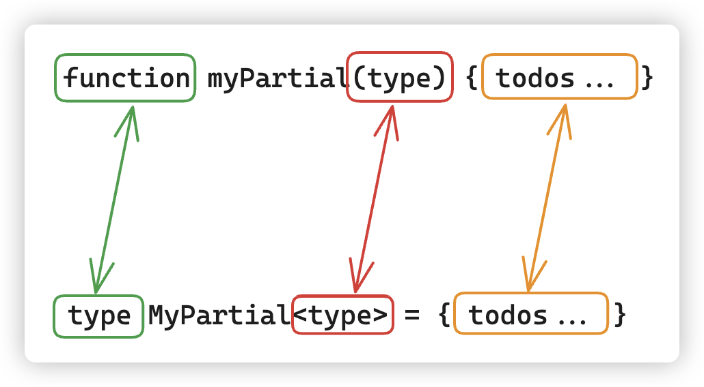
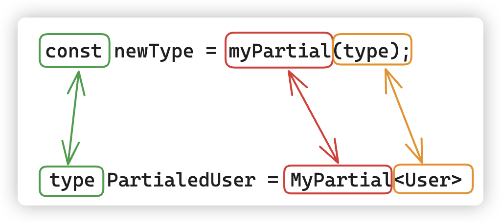

## 类型编程的理解

### 属性修饰符

我们类型编程的代码已经逐步过渡成对泛型的处理：

```typescript
type User = {
  readonly id: number;
  name: string;
  tel: string;
  address?: string;
}

type CopyUser = {
  [key in keyof User]:User[key]
}

type Copy<T extends object> = {
  [key in keyof T]:T[key]
}
```

上面的`Copy<T>`类型只需要我们稍稍做修改，就能成为一个很有用的新的类型别名

```typescript
type MyReadonly<T> = {
  readonly [key in keyof T]: T[key]
}
```

就在之前的代码签名加了`readonly`，这个类型别名就能实现将你传递的类型T所有的属性变为`readonly`

```typescript
type User = {
  readonly id: number,
  name: string
  tel: string
  address?: string
}

type MyReadonly<T> = {
  readonly [key in keyof T]: T[key]
}

type ReadonlyUser = MyReadonly<User>

const u: ReadonlyUser = {
  id: 1,
  name: "jack",
  tel: "135678",
  address: "beijing"
}

u.id = 2; // error 无法分配到 "id" ，因为它是只读属性
u.name = "tom";// error 无法分配到 "name" ，因为它是只读属性
```

又或者说，直接在后面加上`?`，就能将原来类型中所有的属性变为可选

```typescript
type MyPartial<T> = {
  [key in keyof T]?: T[key]
}

type OptionalUser = MyPartial<User>

const u: OptionalUser = {
  id: 1,
  name: "jack"
}
```

`MyReadonly`是[`Readonly<Type>`](https://www.typescriptlang.org/docs/handbook/utility-types.html#readonlytype)的具体实现

`MyPartial`是[`Partial<Type>`](https://www.typescriptlang.org/docs/handbook/utility-types.html#partialtype)的具体实现

其实，这种在现有类型的基础上创建新的类型的方式，在TS中也有专门的称呼：**映射类型（Mapped Types）**，其实和索引签名类型很类似，差别只是**索引签名**用于定义对象可以有哪些类型的键和值，适用于属性名未知或动态的情况。**映射类型**则允许你在现有类型的基础上创建新的类型，通过对原始类型的属性进行转换或应用修饰符，来满足更具体的类型设计需求

### 修饰操作符`+`，`-`

其实上面的`readonly`与`?`的写法是简写，具体应该是给原来的类型**加上`readonly`**，给原来的类型**加上`?`**

- `+`修饰符：写成`+?`或`+readonly`，为映射属性添加`?`修饰符或`readonly`修饰符。

```typescript
type MyReadonly<T> = {
  +readonly [key in keyof T]: T[key]
}

type MyPartial<T> = {
  [key in keyof T]+?: T[key]
}
```

既然有`+`，那就有`-`

- `–`修饰符：写成`-?`或`-readonly`，为映射属性移除`?`修饰符或`readonly`修饰符。

```typescript
type MyRequired<T> = {
  -readonly [key in keyof T]-?: T[key]
}
const u: MyRequired<User> = {
  id: 1,
  name: "jack",
  tel: "135678",
  address: "beijing" // 不写现在会报错，因为已经移除了可选属性
}
u.id = 2; // ok,因为已经移除了只读属性
```

### 泛型编程的理解

Javascript的编程大家很熟悉，如果我们想处理一个值，然后返回一个新的值，理所应当的想到的就是函数

```typescript
function myPartial(type){
  const newType = getOptional(type);
  ......
  return newType
}
const type = {xxxxxx};
const newType = myPartial(type);
```

上面的伪代码使用函数无非就两步：

1、声明函数，传入参数

2、调用函数，获取到新的返回值

**如果我们操作类型，也能像Javascript的函数处理一样，操作旧类型，然后得到了新的类型**，那就很方便了。

```typescript
// 可以当做是函数，可以接受任意类型。
// 由于是这里的 “Type” 形参，因此理什么名字都无所谓，和函数的形参名是一个意思。
type MyPartial<Type> = { todos... }
// 可以当做是函数调用，调用的时候传入了具体的类型 User
// 返回了新的类型 PartialedUser
type PartialedUser = MyPartial<User>
```

来看一下有多像：

**声明的时候**



**调用的时候**



最后只需要将声明中`{todos...}`相关语法，换成Typescript的语法就行了

```typescript
type MyPartial<T> = {
  [key in keyof T]?: T[key]
}
```

有了这个理论，我们来看之前的映射类型，我们写了这样的代码：

```typescript
type AnyTypeHere = {
  [key: string]: any;
}
```

这样写肯定是有一定缺陷的，固定了键的类型，而且值的类型是any，当然我们介绍了Record工具的用法，可以通过Record工具，帮我们定义需要的泛型。这个简单工具，我们完全也可以自己实现。

```typescript
// 对于js来说，我们对值操作
function MyRecord(key,value){
  // todos...
  return {....}
}
```

```typescript
// 对于TS来说，我们对类型操作
type MyRecode<K,V> = {
  // todos......
}
K 我们需要限定一下类型，而V传入什么类型，就应该是什么类型。那这个不是就很简单吗？
type MyRecode<K extends string | number | symbol,V> = {
  [key in K]:V
}

```